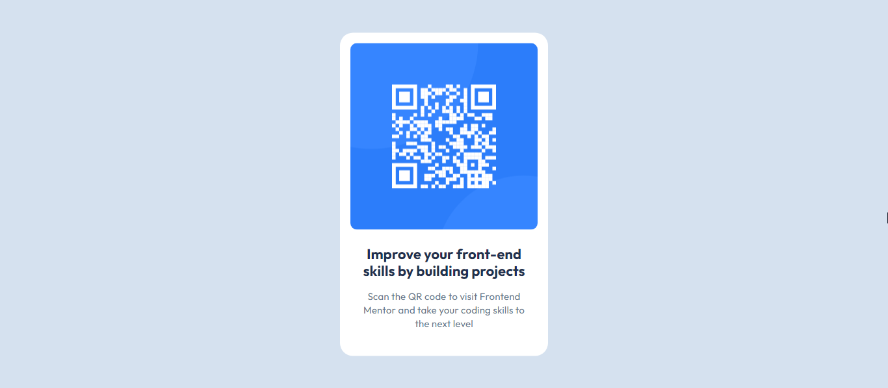

# Frontend Mentor - QR code component solution

This is a solution to the [QR code component challenge on Frontend Mentor](https://www.frontendmentor.io/challenges/qr-code-component-iux_sIO_H). Frontend Mentor challenges help you improve your coding skills by building realistic projects.

## Table of contents

- [Overview](#overview)
- [Screenshot](#screenshot)
- [Links](#links)
- [Built with](#built-with)
- [What I learned](#what-i-learned)
- [Continued development](#continued-development)

## Overview

The challenge here was to build out QR code component and get it looking as close to the design as possible.

### Screenshot



### Links

- Solution URL: https://artemkotko14.github.io/qr_code_component/

### Built with

- Semantic HTML5 markup
- CSS custom properties
- Flexbox

### What I learned

In this task I was required to build out a simple QR code component.

Throught this task I practised my skills with Flexbox. I also practised working with Figma design, using different typography properties(font-family, font-weight, font-size, line-height, letter-spacing) I applied various properties like color, font, and margins to improve visual design and user experience.

While explicit media queries are not used, using flexbox and auto margins helps the layout adjust on different screen sizes.

I implemented a hover effect that adds a subtle shadow (using the box-shadow property) around the card when the user hovers over it, making it pop out.

```css
.card:hover { box-shadow: 0 8px 16px 0 rgba(0, 0, 0, 0.2); }:
```

### Continued development

In future projects, I want to focus on using Flexbox more extensively for layout and alignment, as it provides a powerful and efficient way to create responsive designs. Its ability to easily control the distribution of space, align items both vertically and horizontally, and adapt layouts across different screen sizes makes it an ideal tool for modern web development. By mastering Flexbox, I can reduce the complexity of CSS, avoid unnecessary workarounds with floats and positioning, and ensure that my designs remain flexible and adaptable to various devices and resolutions.
